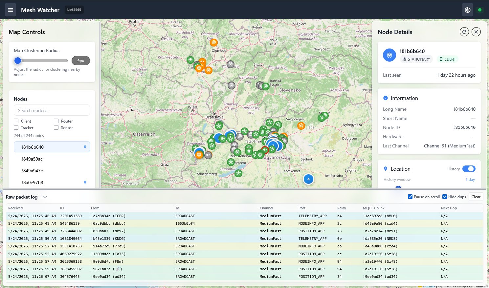

# MeshWatcher

A real-time web application for monitoring [Meshtastic](https://meshtastic.org/) mesh networks. MeshWatcher subscribes to an MQTT broker, decodes incoming packets, and presents nodes, positions, telemetry, and messages on an interactive live map.



## Features

- **Live map** — Visualize all active Meshtastic nodes on an interactive map with configurable clustering.
- **Private channel tracking** — Track your own devices on your private, encrypted channel
- **Node sidebar** — Browse and filter nodes by role (Client, Router, Tracker, Sensor) and monitor their last-seen status at a glance.
- **Node detail panel** — Inspect per-node metadata, telemetry history, and position tracks color-coded by speed and position age.
- **Packet log** — Watch the raw MQTT stream in real time, with automatic duplicate filtering and expandable packet payloads.
- **Auto-cleanup** — Define independent retention periods for each data type to keep your database lean.
- **API + WebSocket** — Integrate with the REST API using optional key-based authentication, or subscribe to live events via Socket.IO.

## Requirements

- Docker + Docker Compose (recommended), or Python 3.13+
- MySQL 8+ database
- Access to a Meshtastic MQTT broker (public or self-hosted)

## Quick Start (Docker)

**1. Copy the sample compose file:**

```bash
cp docker-compose.yaml.sample docker-compose.yaml
```

**2. Create a `.env` file with your settings:**

```env
# Database
MYSQL_USER=meshwatcher
MYSQL_PASSWORD=yourpassword
MYSQL_HOST=your-mysql-host
MYSQL_PORT=3306
MYSQL_DB=meshwatcher

# MQTT broker
MQTT_SERVER=mqtt.meshtastic.org
MQTT_PORT=1883
MQTT_USERNAME=meshdev
MQTT_PASSWORD=large4cats
MQTT_ROOT_TOPIC=msh/EU_868/2/e/
MQTT_CHANNELS={"LongFast": {"key": "AQ=="}}

# Flask
FLASK_SECRET_KEY=change-me-in-production
```

**3. (Optional) Put it behind a reverse proxy:**

It's advisable to put your instance behind a reverse proxy such as Nginx. MeshWatcher uses Socket.IO, so your proxy must support WebSocket upgrades.

*nginx:*
```nginx
server {
    listen 80;
    server_name meshwatcher.example.com;

    location / {
        proxy_pass http://127.0.0.1:8080;
        proxy_http_version 1.1;
        proxy_set_header Upgrade $http_upgrade;
        proxy_set_header Connection "upgrade";
        proxy_set_header Host $host;
        proxy_set_header X-Real-IP $remote_addr;
        proxy_set_header X-Forwarded-For $proxy_add_x_forwarded_for;
        proxy_set_header X-Forwarded-Proto $scheme;
    }
}
```

*Caddy* handles WebSocket upgrades and HTTPS automatically:
```caddy
meshwatcher.example.com {
    reverse_proxy 127.0.0.1:8080
}
```

Set `CORS_ALLOWED_ORIGINS` to your public domain in `.env`.

**4. Start it:**

```bash
docker compose up -d
```

With the default docker-compose file, the app is accessible at **http://your-host:8080** — Docker binds to all interfaces, so it's reachable publicly straight away.

If you're running behind a reverse proxy (see step 3), use your configured domain instead — e.g. **https://meshwatcher.example.com**. Change the port binding to `127.0.0.1:8080:8080` in `docker-compose.yaml` to prevent direct access on port 8080 when using a proxy.

## Configuration

All settings are read from `.env` (or environment variables). The key ones:

| Variable | Default | Description |
|---|---|---|
| `MQTT_SERVER` | `mqtt.creativo.hu` | MQTT broker hostname |
| `MQTT_PORT` | `1883` | MQTT broker port |
| `MQTT_ROOT_TOPIC` | `msh/EU_868/HU/2/e/` | Root MQTT topic to subscribe to |
| `MQTT_CHANNELS` | `{"MediumFast": {"key": "AQ=="}}` | Channel name → decryption key mapping (JSON) |
| `MYSQL_HOST` | `127.0.0.1` | MySQL host |
| `MYSQL_DB` | `meshwatcher` | MySQL database name |
| `FLASK_SECRET_KEY` | `meshtastic!` | Flask session secret — **change this** |
| `NODE_RETENTION_DAYS` | `14` | How long to keep node records |
| `PACKET_RETENTION_DAYS` | `7` | How long to keep raw packets |
| `MESSAGE_RETENTION_DAYS` | `7` | How long to keep text messages |
| `TELEMETRY_RETENTION_DAYS` | `7` | How long to keep telemetry |
| `DB_CLEANUP_PERIOD_MINUTES` | `30` | How often the cleanup job runs |
| `CORS_ALLOWED_ORIGINS` | `*` | Restrict to your domain in production |

See [app/config.py](app/config.py) for the full list.

## Running Locally (without Docker)

For testing or development purposes, you can run the app locally like this:

```bash
python -m venv venv
source venv/bin/activate
pip install -r requirements.txt

# Create a .env file first (see above)
gunicorn -c gunicorn_config.py main:app
```

The database tables are created automatically on first startup.

## API Keys (optional)

To restrict API access, create an `apikeys.yaml` file and mount it into the container:

```yaml
keys:
  - name: my-app
    key: your-secret-api-key
```

Then pass `X-API-Key: your-secret-api-key` in requests. See `docker-compose.yaml.sample` for the volume mount example.

## License

BSD 3-Clause
