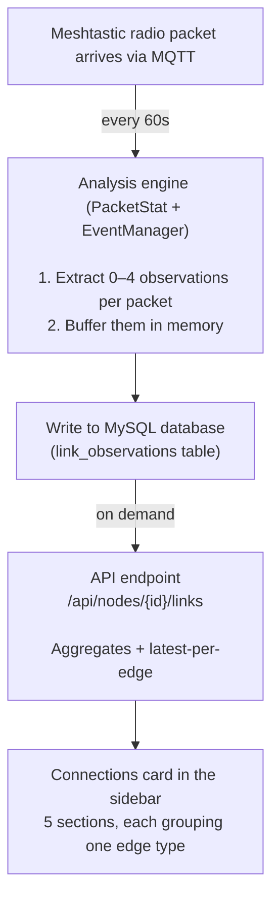
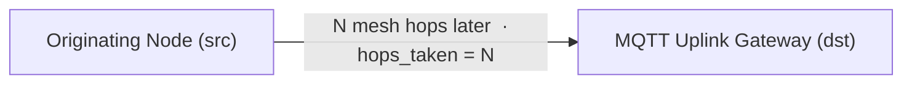
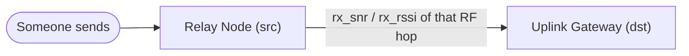
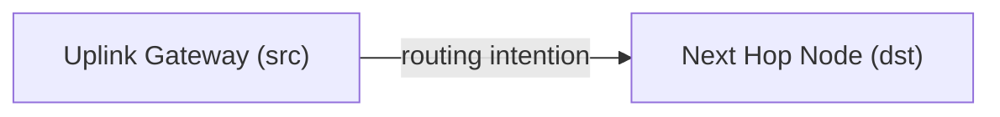
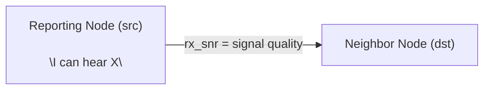
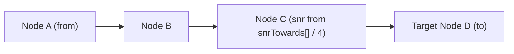
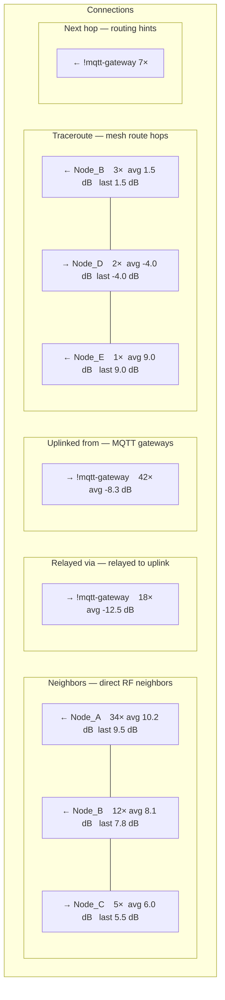

# Statistics Collection & Connections List Guide

*How raw Meshtastic radio packets become the connection data you see in the sidebar.*

---

## 1. The Big Picture

Every Meshtastic packet that arrives at your MQTT gateway passes through an
analysis engine that extracts tiny "observation" records — one-way edges
between nodes.  These observations are stored in a database and later queried
to build the **Connections** list for any node you click on.



Each observation records:
- **Source node** — the node that sent or relayed
- **Destination node** — the node that received (or the uplink gateway)
- **Edge type** — *how* we know about this connection
- **SNR / RSSI** — signal quality (when available)
- **Hops taken** — how many mesh hops were between them (when available)
- **Timestamp** — when it was observed

A single regular data or telemetry packet can produce **up to 3 observations**
at once, each looking at a different relationship between the nodes involved.
Special packet types — neighbor info broadcasts and traceroutes — produce
their own observations through a separate path.

---

## 2. The Six Observation Types

There are 6 kinds of connection evidence, each coming from a different part of
the radio protocol.  Here they are grouped by *source*.

### 2.1 From originating node → Uplink

***Edge type:** `from_to_uplink`*

**Triggered by:** Every non-self-report packet that has hop-start and hop-limit
fields.  This is the most frequent observation — it is recorded for *almost
every* regular data, telemetry, or routing packet.

**What it records:**



**Packet field used:** `from` (always a full 4-byte node ID → `!xxxxxxxx`).

**Meaning:** "Node X sent a packet that reached the internet gateway.  It took
N hops to get there."

**In the Connections card:** Shown under the **"Uplinked from"** section.

**Example row:**

```
    ┌─────────────────────────────────────────────┐
    │  Uplinked from         MQTT gateways        │
    ├─────────────────────────────────────────────┤
    │  → !mqtt-gateway                            │
    │    42× avg -8.3 dB   last: -9.2 dB          │
    └─────────────────────────────────────────────┘
```

The arrow points **out** — the selected node's data flows toward the uplink.
There is no SNR/RSSI here because the originating node doesn't hear itself;
the RF signal quality is only known for the *last RF hop* (see Relay).

### 2.2 Relay node → Uplink

***Edge type:** `relay_to_uplink`*

**Triggered by:** Every non-self-report packet that has a `relay_node` field
set (almost all forwarded packets).

**What it records:**



**Packet field used:** `relay_node` — a 1-byte suffix that identifies the last
node that relayed the packet via LoRa to the gateway.  The system resolves the
suffix to a full node ID whenever possible.

**Special case — direct connection (0 hops):** When `hop_limit` minus
`hop_start` equals 0, the relay suffix is checked against the last byte of
`from`.  If they match, the originating node itself is credited as the relay
— confirming a direct connection between that node and the gateway.

**Meaning:** "Node Y relayed a packet to the internet gateway.  The RF
signal quality on that last hop was S dB SNR / R dBm RSSI."

**In the Connections card:** Shown under the **"Relayed via"** section.

**Example row:**

```
    ┌─────────────────────────────────────────────┐
    │  Relayed via          relayed this node     │
    │                         to uplink           │
    ├─────────────────────────────────────────────┤
    │  → !mqtt-gateway                            │
    │    18× avg -12.5 dB  last: -14.1 dB         │
    └─────────────────────────────────────────────┘
```

The observation count (e.g. "18×") tells you how many distinct packets this
node relayed to the uplink during the time window.

### 2.3 Uplink → Next Hop (routing hint)

***Edge type:** `nexthop`*

**Triggered by:** Forwarded packets that have a `next_hop` field.

**What it records:**



**Packet field used:** `next_hop` — a 1-byte suffix indicating which node the
uplink intends to forward toward next.

**Meaning:** "The gateway's routing table says Node Z is the next hop toward
the final destination."  This is a *routing intention*, not a confirmed
reception — it may not be reliable.

**In the Connections card:** Shown under the **"Next hop"** section, with the
subtitle "routing hints (unconfirmed)".

### 2.4 Neighbor reports

***Edge type:** `neighbor_report`*

**Triggered by:** `NEIGHBORINFO_APP` packets — periodic broadcasts that every
node emits (typically every 300 seconds) listing the nodes it can hear.

**What it records:**



**Packet payload structure:**

```json
{
  "from": 3031777281,
  "decoded": {
    "portnum": "NEIGHBORINFO_APP",
    "payload": {
      "nodeId": 3031777281,
      "neighbors": [
        {"nodeId": 3663224352, "snr": 10.25},
        {"nodeId": 146503212,  "snr": 8.0}
      ]
    }
  }
}
```

**Meaning:** "Node A reports that it can hear Node B with an SNR of about
10 dB."  This is the closest thing to a direct "who is in range" confirmation.

**In the Connections card:** Shown under the **"Neighbors"** section.

**Direction matters:**
- **Incoming arrow (←)** — a peer node reported you as a neighbor.
  Example: `← Node_A` means Node_A can hear the selected node.
- **Outgoing arrow (→)** — the selected node reported the peer as a neighbor.
  Example: `→ Node_B` means the selected node can hear Node_B.

Both confirm that the two nodes are in direct RF range — the arrow direction
just indicates *who published the report*.

### 2.5 Traceroute hops

***Edge type:** `traceroute_hop` and `traceroute_hop_back`*

**Triggered by:** `TRACEROUTE_APP` packets, which are sent when a node does a
traceroute to another node.  The response contains the full route taken.

**What it records:**



**Packet payload structure:**

```json
{
  "from": 2552625594,
  "to": 2956776068,
  "decoded": {
    "portnum": "TRACEROUTE_APP",
    "payload": {
      "route": [2574456035, 146503212],
      "snrTowards": [11, -54, -4],
      "routeBack": [146509480],
      "snrBack": [36]
    }
  }
}
```

**Important:** The raw `snrTowards` values are multiplied by 4 on the wire
(integer encoding).  The system divides by 4 to get the real dB value.

**Meaning:** "The route from Node A to Node D goes through Node B (snr 2.75 dB)
and Node C (snr -13.5 dB)."  Each hop becomes its own observation.

**In the Connections card:** Both `traceroute_hop` and `traceroute_hop_back`
are grouped together under the **"Traceroute"** section with the subtitle
"mesh route hops".

---

## 3. The Connections Card — Section by Section

When you click a node on the map, the sidebar queries:

```
GET /api/nodes/{node_id}/links?since_hours=24&edge_type=neighbor_report,relay_to_uplink,from_to_uplink,traceroute_hop,traceroute_hop_back,nexthop
```

This returns every observation where the node appears as **either source or
destination**, aggregated by unique `(src, dst, edge_type)`.  The system
groups them into 5 sections:

### Section layout



### 3.1 Neighbors arrow direction

```
  Selected node: Node_X

  Row:  ← Node_A      (Node_A reported hearing Node_X)
  Row:  → Node_B      (Node_X reported hearing Node_B)
```

- **Incoming (←)** = the peer node reported you as a neighbor
- **Outgoing (→)** = you reported the peer node as a neighbor

Both confirm that the two nodes are in direct RF range — the arrow direction
just indicates *who published the report*.

### 3.2 Relayed via arrow direction

```
  Selected node: Node_X

  Row:  → !mqtt-gateway    (Node_X relayed packets to the gateway)
```

The selected node is always the source here.  The arrow points **to the
uplink** because Node X's relayed data flows toward the internet.

### 3.3 Uplinked from arrow direction

```
  Selected node: Node_X

  Row:  → !mqtt-gateway    (Node_X's packets reached the gateway)
```

Same direction — the arrow points to the uplink.

### 3.4 Traceroute arrow direction

```
  Selected node: Node_X

  Suppose a traceroute found:  Node_A → Node_B → Node_X → Node_D

  Row:  ← Node_B    (Node_B forwarded to Node_X → incoming)
  Row:  → Node_D    (Node_X forwarded to Node_D → outgoing)
```

The arrow shows the direction of the RF hop relative to the selected node.

### 3.5 Next hop arrow direction

```
  Selected node: Node_X

  Row:  ← !mqtt-gateway    (gateway says "I'm routing toward Node_X")
```

The gateway is the source, Node X is the next hop → incoming arrow.

---

## 4. Reading a Connection Row

```
     ← Node_A       34× avg 10.2 dB  last 9.5 dB
      │               │      │          │
      │               │      │          └── Latest individual SNR
      │               │      └── Average SNR across all observations
      │               └── How many packets produced this edge
      └── Direction: peer → selected (incoming)
          (→ would mean selected → peer, outgoing)

        ┌──────────────────────────────────────┐
        │  SNR color key:                      │
        │  ≥ -5 dB   →  green  (excellent)     │
        │  ≥ -10 dB  →  amber  (okay)          │
        │  < -10 dB  →  red    (weak/noisy)    │
        │  null      →  gray   (no data)       │
        └──────────────────────────────────────┘
```

SNR values are reported in decibels (dB).  Higher values are better.
A value of +10 dB means the signal is 10× above the noise floor.
A value of -15 dB means the signal is below the noise floor and may
be unreliable.

---

## 5. Accordion Detail View

Click any row to expand a table of **individual observations** that make up
that aggregate:

```
  ┌────────────────────────────────────────────────┐
  │  ← Node_A     34× avg 10.2 dB  last 9.5 dB     │
  │  ▼ (expanded)                                  │
  │  ┌──────────────────────────────────────────┐  │
  │  │  # │ observed    │ SNR   │ RSSI │ hops   │  │
  │  ├──────────────────────────────────────────┤  │
  │  │  1 │ 02/17 14:32 │ 9.5   │ -112 │ 0      │  │
  │  │  2 │ 02/17 14:17 │ 10.2  │ -108 │ 0      │  │
  │  │  3 │ 02/17 13:55 │ 8.8   │ -115 │ 0      │  │
  │  │  4 │ 02/17 13:30 │ 11.0  │ -105 │ 0      │  │
  │  │  5 │ 02/17 13:12 │ 10.5  │ -110 │ 0      │  │
  │  │ ...│             │       │      │        │  │
  │  └──────────────────────────────────────────┘  │
  │       1 / 4  Next ►                            │
  └────────────────────────────────────────────────┘
```

Each row in the detail table corresponds to one database observation — one
packet event that produced evidence of this edge.  The detail view shows:

| Column | Meaning |
|--------|---------|
| `#` | Index within this page |
| `observed` | Date/time of the packet |
| `SNR` | Signal-to-noise ratio (dB) for this specific observation |
| `RSSI` | Received signal strength indicator (dBm) for this hop |
| `hops` | How many mesh hops between the two nodes |

The accordion fetches up to 50 observations per edge, covering the last 7
days (168 hours), and paginates 10 per page.

---

## 6. End-to-End Example

Let's trace a single packet through the entire pipeline.

### Packet arrives

```json
{
  "from": 0x12345678,
  "to": 0xFFFFFFFF,
  "channel": 1,
  "relayNode": 0x9A,
  "hopStart": 7,
  "hopLimit": 5,
  "rxSnr": -8.5,
  "rxRssi": -90,
  "nextHop": 0x42
}
```

### Step 1 — The engine analyzes it

**hops_taken = hopStart - hopLimit = 7 - 5 = 2**

The packet traveled 2 mesh hops before reaching the gateway.

### Step 2 — Observations extracted

```
  1. relay_to_uplink:
     src = resolve(0x9A) → let's say !abcdef9a
     dst = !mqtt-gateway
     rx_snr = -8.5, rx_rssi = -90
     ➜ "Node !abcdef9a relayed this packet to the uplink, SNR was -8.5 dB"

  2. from_to_uplink:
     src = !12345678
     dst = !mqtt-gateway
     hops_taken = 2
     ➜ "Node !12345678 sent a packet that reached the uplink in 2 hops"

  3. nexthop:
     src = !mqtt-gateway
     dst = resolve(0x42) → let's say !deadbe42
     ➜ "The gateway's next hop toward the destination is !deadbe42"
```

### Step 3 — Stored in database

```
  link_observations table:
  ┌──────────┬──────────────┬─────────────────┬───────┬──────┐
  │ src_node │ dst_node     │ edge_type       │ rx_snr│ hops │
  ├──────────┼──────────────┼─────────────────┼───────┼──────┤
  │!abcdef9a │!mqtt-gateway │ relay_to_uplink │ -8.5  │ null │
  │!12345678 │!mqtt-gateway │ from_to_uplink  │ null  │ 2    │
  │!mqtt-... │!deadbe42     │ nexthop         │ null  │ null │
  └──────────┴──────────────┴─────────────────┴───────┴──────┘
```

### Step 4 — Viewing Connections for different nodes

**If you click `!12345678` (the originator):**

- **Uplinked from** → 1 edge: → `!mqtt-gateway` (1 observation, 2 hops)
- **Neighbors** → (maybe, if NEIGHBORINFO exists)
- **Relayed via** → (no — this node didn't act as relay in this case)

**If you click `!abcdef9a` (the relay node):**

- **Relayed via** → 1 edge: → `!mqtt-gateway` (1 observation, SNR -8.5)
- **Neighbors** → (maybe)
- **Uplinked from** → (maybe, if it also sent its own packets)

**If you click `!deadbe42` (the next hop):**

- **Next hop** → 1 edge: ← `!mqtt-gateway` (1 observation, routing hint)

---

## 7. The Buffer & Database

Most observations (relay, uplink, and next-hop) are not written to disk one at
a time.  They accumulate in an in-memory buffer and are flushed to the
database in a batch every 60 seconds:

```
  Time:  t=0s      t=15s     t=30s     t=45s     t=60s
         │         │         │         │         │
  Packets: ██ █ ████ ██ █ ███ █ ██ ████ █ ██ ██ ████
         │         │         │         │         │
  Buffer: [........observations accumulating........]
                                                  │
                                            flush to DB
```

This batch approach keeps the gateway responsive under heavy traffic.

Neighbor report and traceroute observations follow a different path — they
are written directly to the database when their respective packet types
arrive, without going through the buffer.

### Retention

Old observations are automatically cleaned up based on the configured
retention period (default: 7 days).  Every cleanup cycle removes rows
older than the threshold.

---

## 8. Quick Reference

| Edge type | Source packet | What it tells you | Section |
|---|---|---|---|
| `neighbor_report` | NEIGHBORINFO_APP broadcast | Node X can hear Node Y directly | Neighbors |
| `relay_to_uplink` | Any forwarded packet with `relay_node` | Node X relayed a packet to the MQTT gateway | Relayed via |
| `from_to_uplink` | Any non-self-report packet with hop info | Node X's packet reached the MQTT gateway | Uplinked from |
| `traceroute_hop` | TRACEROUTE_APP request or response | One hop on the route from A to B | Traceroute |
| `traceroute_hop_back` | TRACEROUTE_APP response with `routeBack` | One hop on the return path from B to A | Traceroute |
| `nexthop` | Any forwarded packet with `next_hop` | The gateway's routing intention toward a node | Next hop |

### What SNR/RSSI values appear where

| Edge type | Has SNR / RSSI? | Notes |
|---|---|---|
| `neighbor_report` | Yes | SNR comes from the NEIGHBORINFO payload (not packet header) |
| `relay_to_uplink` | Yes | SNR/RSSI come from the packet header (`rxSnr` / `rxRssi`) — this is the RF quality of the last hop |
| `from_to_uplink` | No | The originating node's signal is not known here |
| `traceroute_hop` | Yes | Per-hop SNR from `snrTowards[]` (divided by 4) |
| `traceroute_hop_back` | Yes | Per-hop SNR from `snrBack[]` (divided by 4) |
| `nexthop` | No | A routing hint, not a real RF observation |
